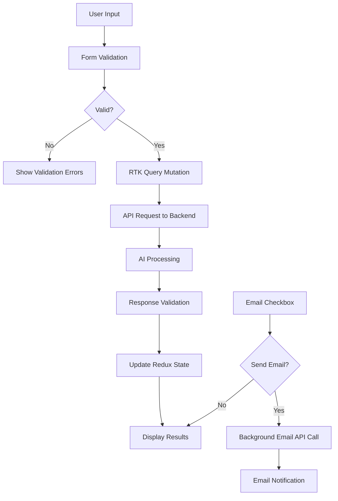

# 🏗️ React + RTK Query Architecture Documentation

## 📁 Project Structure

```
project/
├── 🐍 Backend (Python)
│   ├── agent/                    # AI workflow management
│   ├── config/                   # Configuration files
│   ├── tools/                    # AI tools (weather, email, etc.)
│   ├── utils/                    # Utility functions
│   └── main.py                   # FastAPI server entry point
│
└── ⚛️ Frontend (React + TypeScript)
    └── frontend/
        └── src/
            ├── 🏪 app/                    # Redux store & root app
            │   ├── store/
            │   │   ├── store.ts          # Main Redux store configuration
            │   │   └── hooks.ts          # Typed Redux hooks
            │   ├── App.tsx               # Root component with routing
            │   └── main.tsx              # React entry point
            │
            ├── 🧩 components/            # Reusable UI components
            │   └── ui/
            │       ├── ThemeToggle.tsx   # Dark/light mode toggle
            │       ├── Loaders.tsx       # Loading components
            │       └── Footers.tsx       # Footer components
            │
            ├── ⚡ features/              # Feature-based Redux slices
            │   └── auth/
            │       └── authSlice.ts      # Authentication state
            │
            ├── 📄 pages/                 # Page components
            │   ├── home/
            │   │   └── HomeScreen.tsx    # Home page
            │   └── feature/
            │       ├── MainPage.tsx      # Main interface
            │       └── ResultsDisplay.tsx # Results display
            │
            ├── 🌐 services/              # API services (RTK Query)
            │   └── api/
            │       ├── api_client.ts     # Base API client
            │       ├── data/
            │       │   └── dataApi.ts    # Main data API
            │       └── email/
            │           └── emailApi.ts   # Email service API
            │
            ├── 🛠️ utils/                 # Utility functions
            │   ├── constants/
            │   │   ├── api_constants.ts  # API endpoints
            │   │   └── app_constants.ts  # App constants
            │   └── validation/
            │       └── schema.ts         # Zod validation schemas
            │
            └── 🎨 styles/                # Global styles
                ├── App.css
                └── index.css
```

## 🔄 RTK Query Architecture

### Store Configuration

```typescript
// src/app/store/store.ts
export const store = configureStore({
    reducer: {
        [dataApi.reducerPath]: dataApi.reducer,        // Main data API slice
        [emailApi.reducerPath]: emailApi.reducer,      // Email API slice
    },
    middleware: (getDefaultMiddleware) =>
        getDefaultMiddleware().concat(
            dataApi.middleware,      // RTK Query middleware for data API
            emailApi.middleware      // RTK Query middleware for email API
        ),
});
```

### API Services Structure

#### 1. Main Data API Service (`dataApi.ts`)

```typescript
export const dataApi = createApi({
    reducerPath: "dataApi",
    baseQuery: fetchBaseQuery({
        baseUrl: ApiConstants.API_BASE_URL,
        prepareHeaders: (headers) => {
            headers.set('ngrok-skip-browser-warning', 'true');
            headers.set('Content-Type', 'application/json');
            return headers;
        },
    }),
    tagTypes: ['DataPlan'],
    endpoints: (builder) => ({
        getDataPlan: builder.mutation<DataResponse, DataQuery>({
            // Mutation configuration
        }),
    }),
});
```

**Key Features:**
- ✅ Zod validation for request/response
- ✅ Error handling with typed responses
- ✅ Request transformation (adds formatting instructions)
- ✅ Response validation
- ✅ Cache invalidation with tags

#### 2. Email API Service (`emailApi.ts`)

```typescript
export const emailApi = createApi({
    reducerPath: "emailApi",
    baseQuery: fetchBaseQuery({
        baseUrl: ApiConstants.API_BASE_URL,
        prepareHeaders: (headers) => {
            headers.set('ngrok-skip-browser-warning', 'true');
            headers.set('Content-Type', 'application/json');
            return headers;
        },
    }),
    tagTypes: ['Email'],
    endpoints: (builder) => ({
        sendEmail: builder.mutation<{ message: string }, SendEmail>({
            // Email sending configuration
        }),
    }),
});
```

### Typed Redux Hooks

```typescript
// src/app/store/hooks.ts
export const useAppDispatch = () => useDispatch<AppDispatch>();
export const useAppSelector: TypedUseSelectorHook<RootState> = useSelector;
```

## 🔄 Data Flow Architecture

### 1. Main Data Processing Flow



### 2. Component Data Flow

```typescript
// Main component flow
MainPage
├── useGetDataPlanMutation()       // RTK Query hook
├── useSendEmailMutation()         // RTK Query hook
└── Form Validation (Zod)         // Client-side validation
```

## 🎯 Key Implementation Patterns

### 1. RTK Query Mutations

```typescript
// Usage in components
const [getDataPlan, { data, error, isLoading }] = useGetDataPlanMutation();
const [sendEmail, { isLoading: isSendingEmail }] = useSendEmailMutation();

// Async execution
const planData = await getDataPlan({
    question: validationResult.data.question,
}).unwrap();
```

### 2. Validation Pipeline

```typescript
// 1. Zod Schema Definition
export const querySchema = z.object({
    question: z.string()
        .min(10, 'Please provide more details...')
        .max(500, 'Please keep your question under 500 characters')
        .refine(/* domain-specific validation */)
});

// 2. Client-side Validation
const validationResult = querySchema.safeParse({ question });
if (!validationResult.success) {
    // Handle validation errors
}

// 3. API Response Validation
transformResponse: (response: DataResponse): DataResponse => {
    const validation = responseSchema.safeParse(response);
    if (!validation.success) {
        throw new Error('Invalid response structure');
    }
    return validation.data;
}
```

### 3. Error Handling Strategy

```typescript
// RTK Query Error Transformation
transformErrorResponse: (response: FetchBaseQueryError) => {
    const status = 'status' in response ? response.status : 'UNKNOWN_STATUS';
    const data = 'data' in response ? response.data : 'An unexpected error occurred';
    
    return {
        status: status,
        data: typeof data === 'string' ? data : 'An unexpected error occurred'
    };
}
```

### 4. Background Processing Pattern

```typescript
// Primary action (data processing)
const planData = await getDataPlan(query).unwrap();

// Background action (email sending) - non-blocking
if (sendAsEmail && planData) {
    sendEmail(emailData)
        .unwrap()
        .then(() => setEmailNotification({ type: 'success', message: '...' }))
        .catch(() => setEmailNotification({ type: 'error', message: '...' }));
}
```

## 🔧 Configuration & Constants

### API Configuration

```typescript
// src/utils/constants/api_constants.ts
export class ApiConstants {
    static readonly API_BASE_URL = "https://your-api-endpoint.com/";
    static readonly QUERY_ENDPOINT = "/query";
    static readonly SEND_EMAIL_ENDPOINT = "/send-email";
}
```

### App Constants

```typescript
// src/utils/constants/app_constants.ts
export const EXAMPLE_QUESTIONS = [
    "Example query 1",
    "Example query 2",
    // ...
];

export const DEFAULT_EMAIL_BODY = "Here's your AI-generated response...";
```

## 🚀 Performance Optimizations

### 1. RTK Query Caching
- Automatic caching with `tagTypes`
- Cache invalidation on mutations
- Background refetching

### 2. Component Optimization
- Conditional rendering for email form
- Debounced validation clearing
- Memoized selectors

### 3. Loading States
- Separate loading states for data processing and email
- Progressive UI updates
- Background processing indicators

## 🔒 Type Safety

### 1. API Types
```typescript
export type DataQuery = z.infer<typeof querySchema>;
export type DataResponse = z.infer<typeof responseSchema>;
export type SendEmail = z.infer<typeof sendEmailSchema>;
```

### 2. Redux Types
```typescript
export type RootState = ReturnType<typeof store.getState>;
export type AppDispatch = typeof store.dispatch;
```

### 3. Component Props
- Strict TypeScript interfaces
- Zod schema validation
- Runtime type checking

## 📱 Responsive Design Strategy

- Mobile-first approach with Tailwind CSS
- Smooth transitions and animations
- Accessible form controls and navigation

## 🧪 Testing Considerations

### Recommended Testing Strategy
1. **Unit Tests** - Zod schemas, utility functions
2. **Integration Tests** - RTK Query API calls
3. **Component Tests** - React Testing Library
4. **E2E Tests** - Cypress for user flows

### Key Test Areas
- Form validation logic
- API error handling
- Email functionality
- Responsive behavior